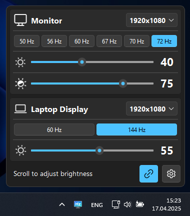
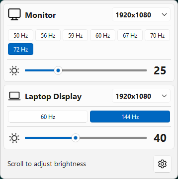
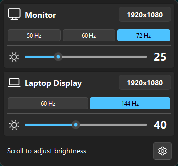
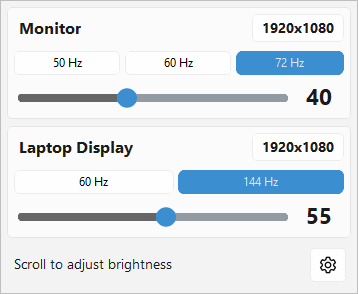
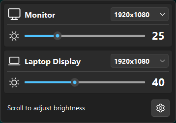
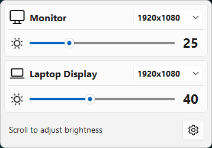

# MoniTune

Easily manage the brightness, resolution, and refresh rate of your monitors in Windows from the system tray

## Screenshots

| Dark                          | Light                          |
| ------------------------------| ------------------------------ |
|  |  |
|  |  |
|  |  |
