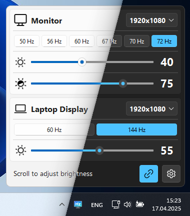

# MoniTune

Easily manage the brightness, resolution, and refresh rate of your monitors in Windows from the system tray.

  

## Features
- Adds brightness sliders to the system tray.
- Can automatically change monitor brightness depending on the time of day.
- Control contrast.
- Change monitor resolution and refresh rate from the system tray.
- Eye break reminders.
- Supports dynamic monitor configuration changes.